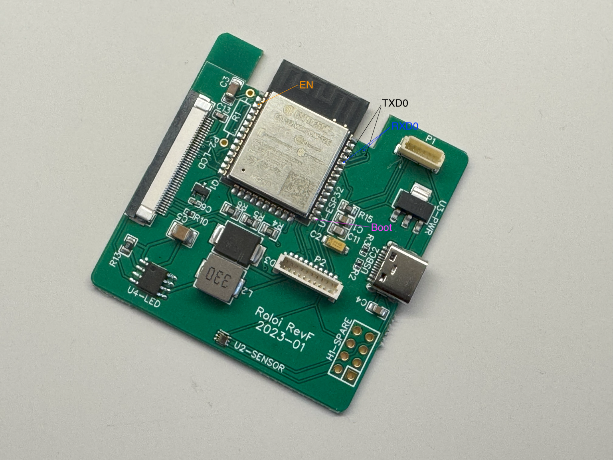

# Programming the Frixos ESP32

This document describes how to flash firmware onto the Frixos board via the P1 UART programming header.



*Roloi RevF 2023-01 — EN, TXD0, RXD0, Boot, and P1 connector labelled*

## Requirements

- USB-to-serial adapter (FTDI TTL-232R-3V3, CP2102, CH340, or equivalent) operating at **3.3 V logic**
- ESP-IDF v6.0 installed and activated

## ESP32-WROOM-32 Module Pinout

```
                            ╔═══ Antenna ═══╗
                            ╚═══════════════╝
                       ┌───────────────────────┐
              GND   1 ─┤                       ├─ 38  GND
             3.3V   2 ─┤                       ├─ 37  GPIO23
         ★    EN    3 ─┤                       ├─ 36  GPIO22
           GPIO36   4 ─┤    ESP32-WROOM-32     ├─ 35  TXD0/GPIO1  ★
           GPIO39   5 ─┤                       ├─ 34  RXD0/GPIO3  ★
           GPIO34   6 ─┤                       ├─ 33  GPIO21
           GPIO35   7 ─┤                       ├─ 32  NC
           GPIO32   8 ─┤                       ├─ 31  GPIO19
           GPIO33   9 ─┤                       ├─ 30  GPIO18
           GPIO25  10 ─┤                       ├─ 29  GPIO5
           GPIO26  11 ─┤                       ├─ 28  GPIO17
           GPIO27  12 ─┤                       ├─ 27  GPIO16
           GPIO14  13 ─┤                       ├─ 26  GPIO4
           GPIO12  14 ─┤                       ├─ 25  GPIO0   ★
                       └─┬───┬──┬──┬──┬──┬──┬──┬──┬─┘
                         15  16  17  18  19  20  21  22  23  24
                        GND G13 SD2 SD3 CMD CLK SD0 SD1 G15 G2
                                 └────────────────┘
                               internal flash (do not use)

  ★ = Programming / boot-mode pins
```

## ESP32-WROOM UART0 Programming Pins

The ESP32-WROOM uses UART0 for flashing. The relevant signals are:

| ESP32 Signal | GPIO  | Module Pin | Direction        | Description                                      |
|--------------|-------|------------|------------------|--------------------------------------------------|
| TXD0         | GPIO1 | Pin 35     | ESP32 → adapter  | Serial transmit                                  |
| RXD0         | GPIO3 | Pin 34     | adapter → ESP32  | Serial receive                                   |
| GPIO0        | GPIO0 | Pin 25     | adapter → ESP32  | Boot mode select — hold LOW during reset to enter download mode |
| EN (CHIP_PU) | EN    | Pin 3      | adapter → ESP32  | Chip enable / reset — pulse LOW to reset         |
| VCC          | 3.3 V | Pin 2      | adapter → ESP32  | Power (3.3 V only — do not apply 5 V)            |
| GND          | GND   | Pin 1      | —                | Common ground (also pins 15, 38)                 |

> **Module pin layout:** 14 pins each on the left (1–14) and right (25–38) sides, and 10 pins along the bottom (15–24). Pins 17–22 connect to the internal SPI flash — do not use.

> **Note:** The firmware forces GPIO0 HIGH at startup (`f-pwm.c`) to prevent unintended download-mode entry during normal operation. When flashing, GPIO0 must be held LOW before EN is released.

## P1 Connector Pinout

P1 is a 6-pin JST 1 mm pitch connector ([LCSC C495540](https://www.lcsc.com/product-detail/C495540.html)). Pins 7 and 8 on the footprint are PCB mounting pads. The pinout below is confirmed from the schematic.

| Role | Part | Description |
|------|------|-------------|
| Board header | BM06B-SRSS-TBT(LF)(SN) | JST SH series, SMD, top-entry, 6-pin, 1.0 mm pitch |
| Mating housing | [SHR-06V-S-B](https://www.digikey.com/en/products/detail/jst-sales-america-inc/SHR-06V-S-B/759870) | JST SH cable housing, 6-pin, 1.0 mm pitch |
| Crimp contacts | SSH-003T-P0.2 | For 28–32 AWG wire, crimped into SHR-06V-S-B |
| Pre-made cable | [Pololu 6-pin JST SH cables](https://www.pololu.com/category/351/6-pin-jst-sh-style-cables) | 28 AWG, various lengths, single- and double-ended |
| Pre-made cable (Amazon) | [20-pair 6-pin JST SH 1.0mm (B0BKSNMCV4)](https://www.amazon.com/dp/B0BKSNMCV4) | 26 AWG, 150 mm, male+female pairs |

| Pin | Signal | Notes                                          |
|-----|--------|------------------------------------------------|
| 1   | TXD    | ESP32 TXD0 (GPIO1) → adapter RX               |
| 2   | IO0    | Boot mode select (GPIO0) — hold LOW to enter download mode |
| 3   | RXD    | ESP32 RXD0 (GPIO3) ← adapter TX               |
| 4   | GND    | Common ground                                  |
| 5   | +3V3   | 3.3 V power                                   |
| 6   | EN     | Chip enable / reset — pulse LOW to reset       |

Adapters that implement the standard DTR/RTS auto-reset circuit (used by esptool) will automatically toggle EN and GPIO0 to enter download mode without manual intervention — connect DTR to EN (pin 6) and RTS to IO0 (pin 2).

## Flashing

Activate ESP-IDF, then:

```bash
source ~/.espressif/tools/activate_idf_v6.0.sh

# Replace with the actual serial port for your adapter
idf.py -p /dev/tty.usbserial-* flash monitor
```

To flash without monitoring:

```bash
idf.py -p /dev/tty.usbserial-* flash
```

## Build Artifacts

The ESP-IDF build produces four binary files, each destined for a specific flash offset defined in `partitions.csv`:

| File | Flash Offset | Description |
|------|-------------|-------------|
| `build/bootloader/bootloader.bin` | `0x1000` | Second-stage bootloader. Initializes flash, reads the partition table, and selects which app slot to boot. |
| `build/partition_table/partition-table.bin` | `0x8000` | Binary form of `partitions.csv`. Tells the bootloader where every partition lives on flash. |
| `build/frixos.bin` | `0x10000` | Main application firmware (ota_0 slot). |
| `build/spiffs.bin` | `0x670000` | SPIFFS filesystem image built from the `./spiffs` directory (web UI files). Included because `FLASH_IN_PROJECT` is set in `CMakeLists.txt`. |

`idf.py flash` reads `build/flasher_args.json` — a manifest generated during build that lists every binary with its offset and flash parameters — and calls `esptool.py` to write them all in one shot.

Individual components can also be flashed separately:

```bash
idf.py bootloader-flash       # just the bootloader
idf.py partition-table-flash   # just the partition table
idf.py app-flash               # just frixos.bin
```

**For OTA updates**, only `frixos.bin` is needed — the OTA process writes it to the alternate app slot and switches the boot partition. The bootloader, partition table, and SPIFFS are not touched during OTA.

## Manual Boot Mode (if auto-reset is not working)

1. Hold GPIO0 LOW (press BOOT button if present, or bridge pin to GND)
2. Pulse EN LOW briefly (press RESET button, or bridge to GND then release)
3. Release GPIO0
4. Run `idf.py flash`
